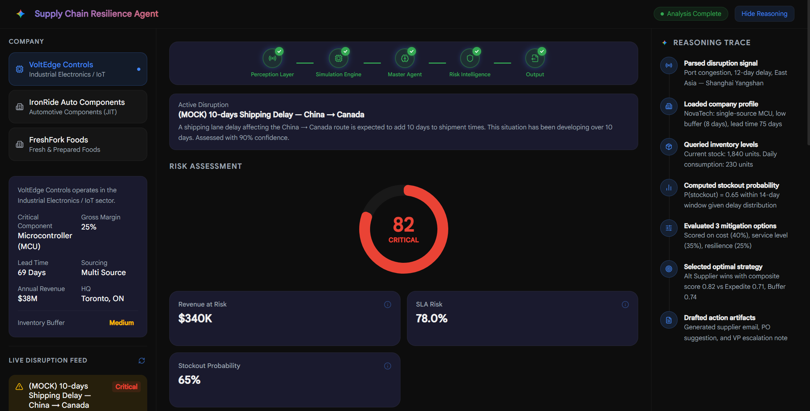
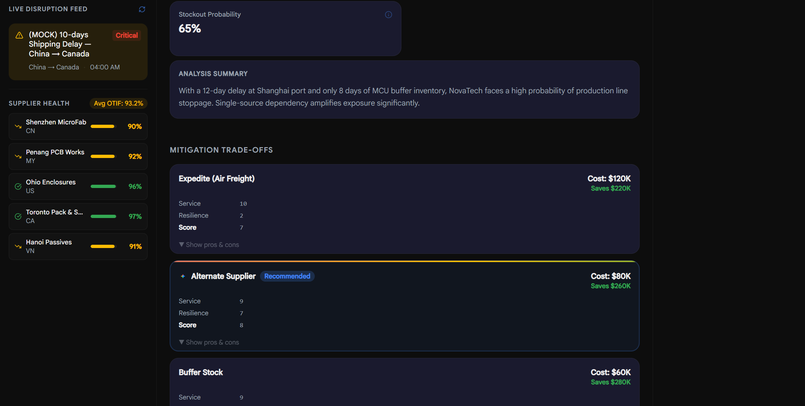
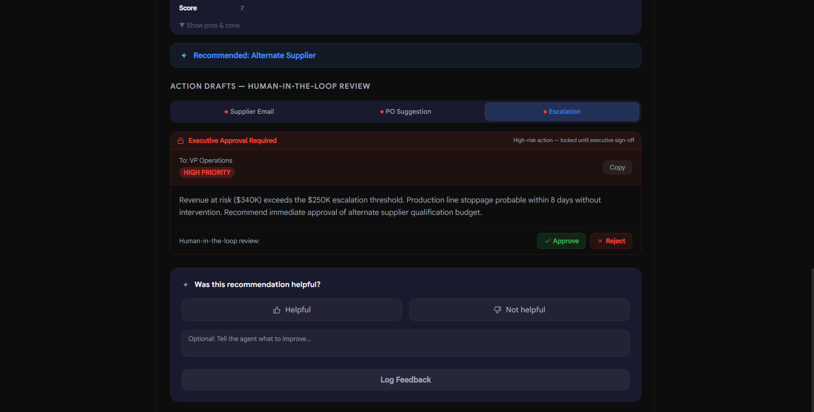
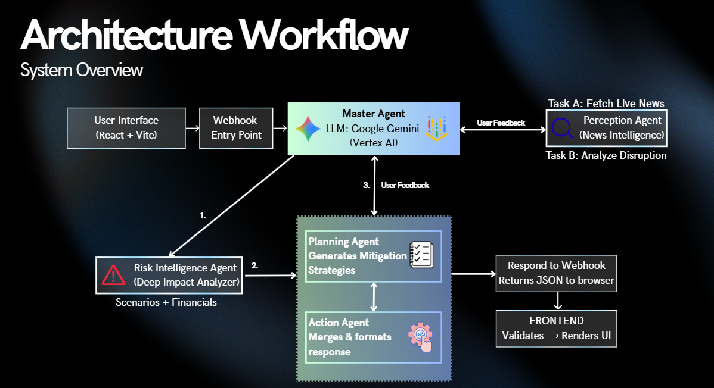

# Supply Chain Resilience Agent

Built for **Hack the Future 2026 (Google AI)**. Weightless Agents is an AI co-pilot that helps mid-market manufacturers detect supply chain disruptions earlier, model financial impact, and generate decision-ready mitigation plans, all with human approval before any action is taken.

## Demo

[Watch the live demo](https://www.youtube.com/watch?v=NlhX5qE0ioA&t=260)

> Note: The video shows an earlier version of the UI. See the updated interface below.

## Architecture

Multi-agent system orchestrated through n8n, powered by Gemini on Google Vertex AI:

- **Master Agent** — Orchestrates the pipeline, synthesizes the final risk report with mitigation options, reasoning trace, and drafted actions.
- **Perception Agent** — Fetches real-time news via NewsAPI (n8n layer) and GNews API (frontend layer), extracts top signals and summarizes risks.
- **Risk Intelligence Agent** — Scores disruption probability, models lead time/inventory impact, simulates three scenarios, calculates financial exposure.

## Tech Stack

Gemini (Vertex AI) · n8n · React + Vite · NewsAPI · GNews API · Tavily

## Responsible AI

- **Human-in-the-Loop:** Drafts actions but never executes. High-risk cases follow a defined escalation path.
- **Transparent Reasoning:** Timestamped reasoning traces showing KPI drivers and trade-off logic.
- **Bias Mitigation:** Recommendations grounded in objective metrics. Insufficient evidence is disclosed, not fabricated.

## Documents

[`HTF-Deck-WeightlessAgents.pdf`](./docs/HTF-Deck-WeightlessAgents.pdf) — Pitch deck.

[`HTF2.0-case-package.pdf`](./docs/HTF2.0-case-package.pdf) — Case package.

## Getting Started

1. **Frontend:** `cd frontend && npm install && npm run dev`
2. **n8n:** Import `HTF-weightlessagent-final-v2.0.json` and configure Vertex AI credentials + NewsAPI key.
3. **Webhook:** Update the n8n webhook URL in `frontend/src/utils/api.js` (`N8N_WEBHOOK_URL` constant) so the frontend points to your active n8n workflow endpoint.